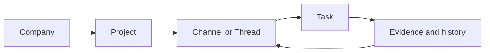
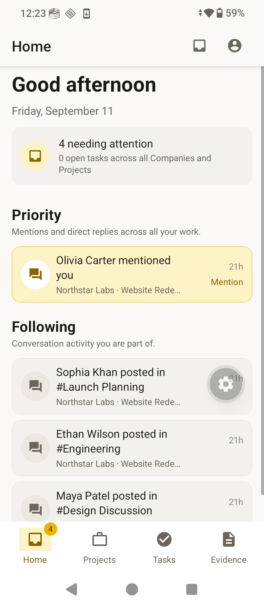
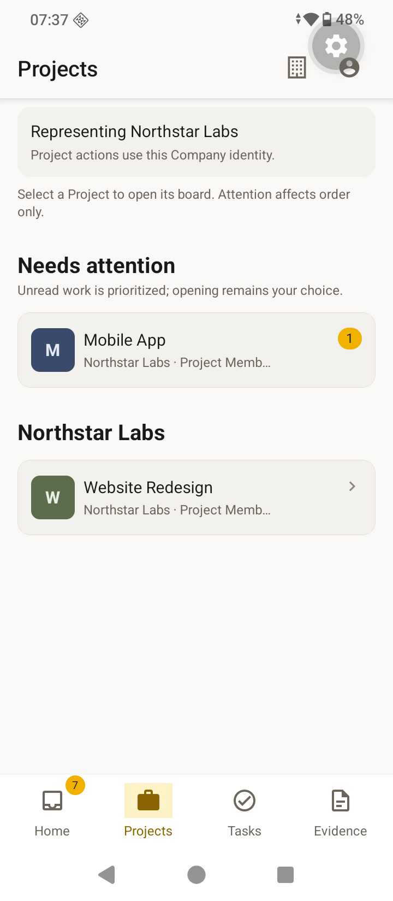
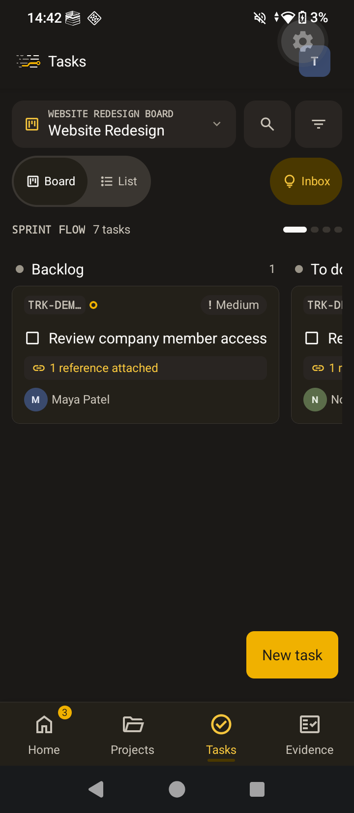
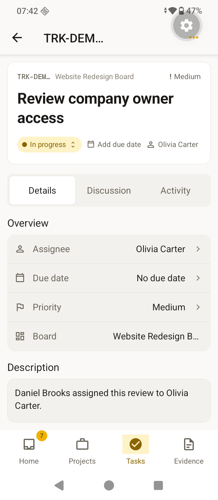
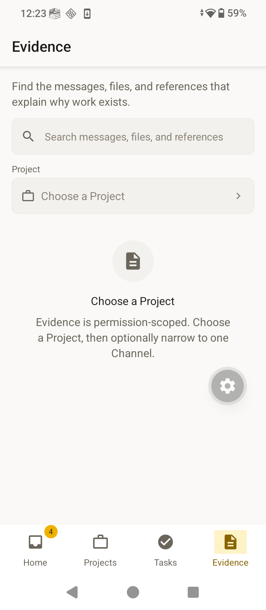

# Track web and mobile changes

Track now gives people one clear path from a Company to a Project, from a chat to a task, and from a task back to its source.

## What changed

- The web app now has a clearer Company and Project shell.
- Tasks, Channels, Threads, Evidence, and Memory share the same spacing, buttons, fields, focus states, and safe dialogs.
- The mobile app now has cleaner Home, Projects, Task Board, Task Detail, Evidence, chat, thread, and notification flows.
- The mobile bottom navigation is easier to read on Android, and the Project Task Board keeps its original header layout.
- The backend now uses priority-aware task indexes, so filtered task pages return the right tasks without breaking cursor pagination.
- Tests cover the new dialogs, labels, dates, toasts, mentions, tasks, threads, navigation, and mobile helpers.

## How the main flow works

Each step keeps its place and source. A person can move forward to do work, then move back to see why the work exists.

## Proof at a glance

| Check | Result | Meaning |
|---|---:|---|
| Lint | 100% passed | Web, mobile, shared, and Convex code passed lint. |
| Type check | 100% passed | Backend and all app packages passed TypeScript checks. |
| Tests | 279 / 279 passed (100%) | Shared, web, mobile, and Convex tests are green. |
| Dependency audit | 0 known vulnerabilities | Production dependencies passed the audit. |
| Production build | Passed | Web client, server, Nitro output, and mobile build step completed. |
| Mobile evidence | 5 / 5 screenshots (100%) | Five real Android emulator views are included below. |

## Mobile screenshots

These are real Android emulator captures using demo data. They show the main paths a team member will review.

### 1. Home

### 2. Projects

### 3. Project Task Board

### 4. Task Detail

### 5. Evidence

## Change map

| Area | Main result | Review value |
|---|---|---|
| Web | Shared Company, Project, task, thread, search, and evidence patterns | Easier desktop navigation and safer actions |
| Mobile | Consistent screens, cards, sheets, task board, and Android navigation | Easier phone use and clearer work context |
| Backend | Scoped task data, priority indexes, and cursor-safe filtering | Correct results as task lists grow |
| Tests and docs | Regression tests, audit notes, design rules, and screenshots | Faster review and safer future changes |

## Limits

The screenshots prove the current emulator layout and working paths. They do not claim exact Figma pixel parity because the connected Figma session did not expose the reference file for reliable inspection.

No password, token, or private credential is included in the screenshots.
