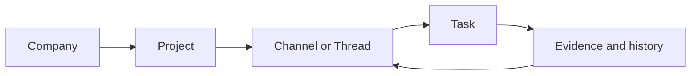
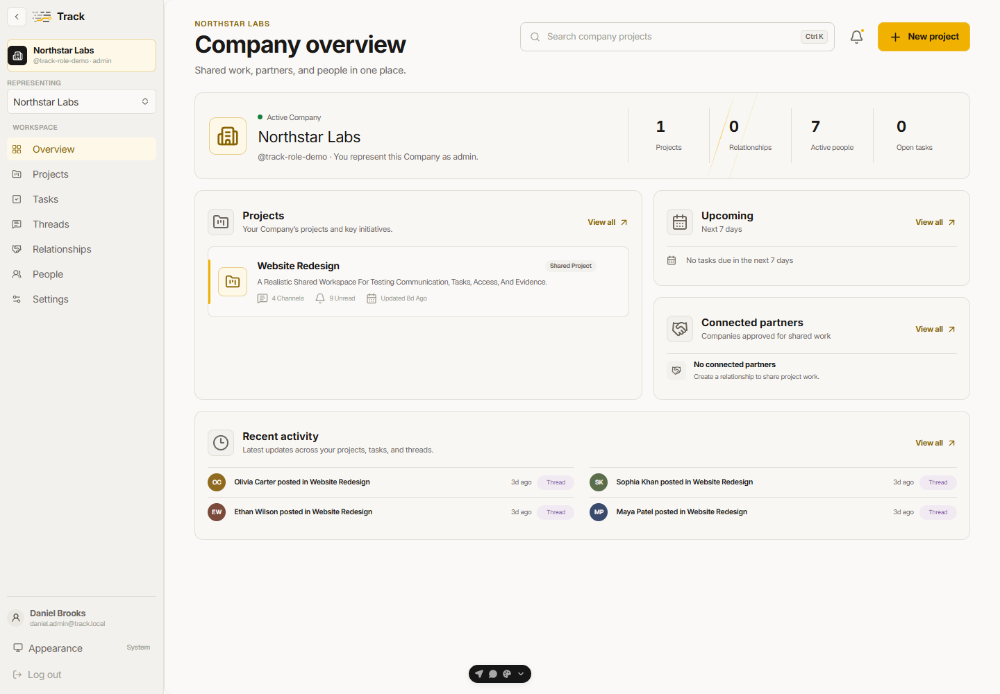
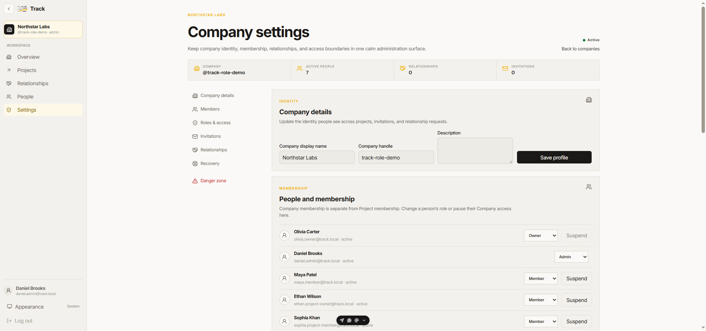
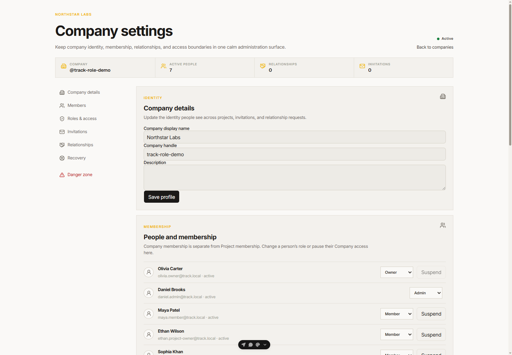
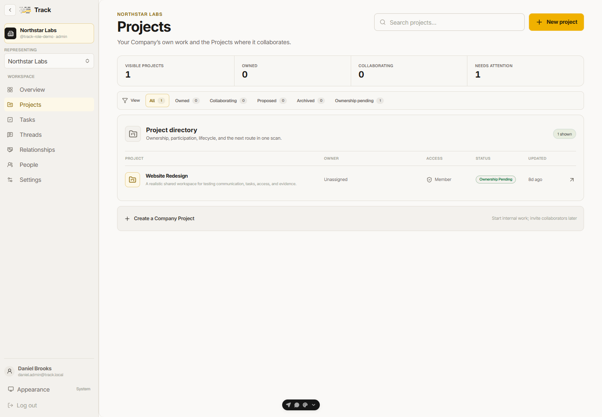
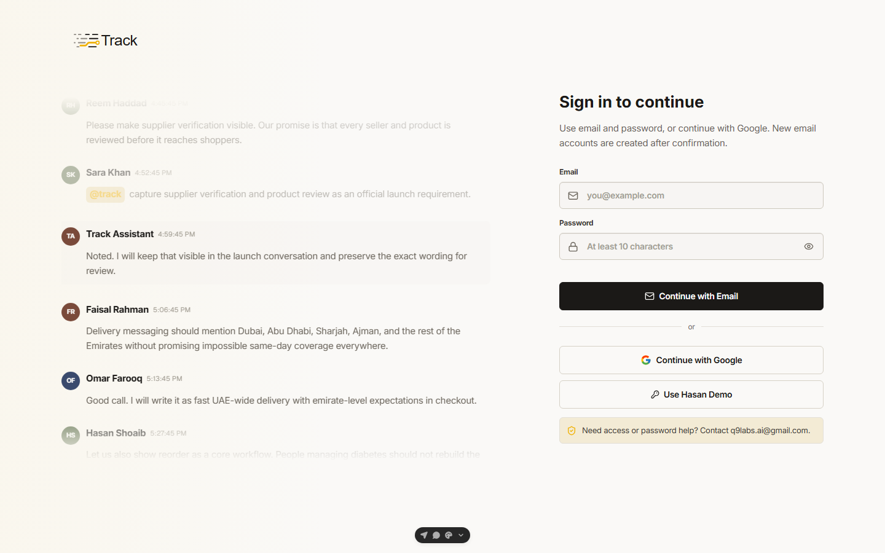

# Track web app change summary

Track now gives people one simple path from a Company to a Project, from a chat to a task, and from a task back to its source.

## What changed

- The Company and Project pages now share one clear shell, with the current place shown in the sidebar and header.
- Tasks, Channels, Threads, Evidence, and Memory use the same spacing, focus rings, buttons, fields, and overlays.
- Destructive actions now ask first. Delete, move, archive, forward, close, and logout actions use the same safe dialog.
- Actions that were easy to miss on hover are also available with a keyboard and on touch screens.
- Notifications, filters, labels, dates, mentions, and status names now use clearer words and steady layouts.
- The web suite has focused tests for the new dialog, label, date, toast, mention, task, thread, and navigation behavior.

## How the main flow works

Each step keeps its place and source. A person can move forward to do work, then move back to see why the work exists.

## Proof at a glance

| Check | Result | Meaning |
|---|---:|---|
| Web test files | 40 / 40 (100%) | Every web test file passed. |
| Web tests | 111 / 111 (100%) | The tested web behavior is green. |
| Web build | Passed | Client, server, and Nitro output built. |
| Web lint and type check | 2 / 2 (100%) | The web code passed both checks. |
| Screenshots included | 5 / 5 (100%) | Five web views are attached below. |
| Full repository test gate | Blocked | One existing Convex pagination test still fails. |
| Figma pixel comparison | Blocked | The connected Figma account has View access, not file edit access. |

The numbers show checks, not product quality. The open backend and Figma items are called out so nobody mistakes a green web suite for a fully closed release.

## Web screenshots

These screenshots use demo data. They show the web shell, Company overview, Company settings, Projects, and sign-in flow.

### 1. Company overview

### 2. Company settings shell

### 3. Company settings form

### 4. Projects directory

### 5. Sign-in

No password, token, or private credential is included in these captures.

## Checks still open

- `convex/taskManagement.test.ts:215` still returns an empty bounded task page instead of the expected task ID.
- Profile and Project Settings need a valid local auth origin and session before they can be checked live.
- Figma parity needs a session with the file exposed to the connector.

## Branch

This summary and the five web screenshots are pushed to `zohaib/web&app-changes`.
