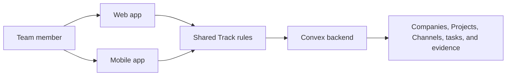
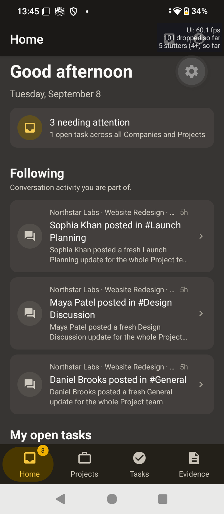
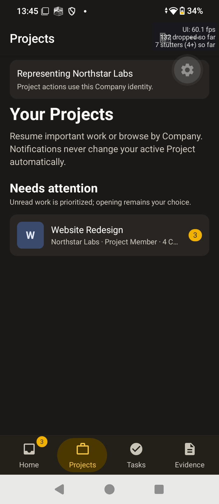

# Web and app changes

Track now makes it easier to move from a talk to the work that came from it. The web app and mobile app use the same Company, Project, Channel, task, and evidence rules, so the team sees one clear story.

## What changed

- The mobile app has a new Home area that shows work needing attention, followed conversations, and open tasks. This helps a person know what to do next.
- Mobile navigation now keeps Home, Projects, Tasks, and Evidence close at hand. Each area has its own route, so moving around is simple and predictable.
- Project and task screens now show clearer actions, states, and errors. A person gets useful feedback instead of a silent failure.
- The web app has clearer Company and Project pages, stronger task tools, and small toast messages that explain what happened after an action.
- Convex now applies the same Company, Project, Channel, and task rules behind both apps. This keeps private work inside the right boundary.

## Change size

These percentages show the share of changed lines in the current working tree. They show where the diff is large, but they do not measure value or effort.

| Area | Share | Changed lines | What it means |
|---|---:|---:|---|
| Web | 64.1% | 23,332 | Most of the diff is in web screens, routes, and styles. |
| Mobile | 24.1% | 8,773 | The app has new navigation, screens, helpers, and tests. |
| Backend | 9.3% | 3,401 | Convex adds and tightens shared access and work rules. |
| Shared and docs | 2.4% | 878 | Shared policy, setup files, and product notes stay aligned. |

## How the pieces work together

Both apps ask the same backend for the same work. The backend checks who the person is and what they may see or change, so one screen cannot quietly bypass another screen's rules.

## Live device proof

These captures came from the current branch running on the connected physical Android device. They contain demo workspace data.

### Home

### Projects

### Short navigation video

[Watch the 15-second mobile navigation video](./assets/mobile-physical-navigation.mp4)

## Checks completed

- Metro answered its health check and served the Android bundle with HTTP 200.
- The live app opened Home and Projects from the current branch.
- Recent Android logs showed no `Unable to load script` message or fatal React Native error during capture.
- The screenshots were checked before they were added. No password or private credential appears in them.
- Lint and type checks passed for web, mobile, and shared code.
- All 54 test files passed. They ran 165 tests in total.
- The production dependency audit found no known security problems.
- The web, mobile, and shared build gate passed.
